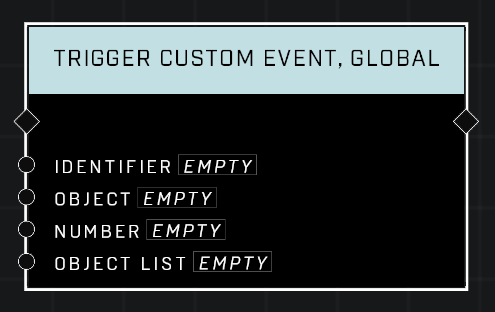

# Trigger Custom Event, Global

## Description
Triggers a custom event with a matching *Identifier* in ANY script brain and waits for completion before resuming. Only triggers **On Custom Event, Global** nodes. Unless you have a specific need for multiple script brains, it is best to use the non-global version of **Trigger Custom Event**.

## Node Type
Nodes fall into two basic categories: Data and Execution. This Execution node triggers other node strings to start firing.

## Inputs
| Input | Type | Required | Description |
|------------------|------------------|----------|--------------------------------------------------------------|
| Identifier | String | Yes | Triggers a custom Event for this same identifier. |
| Object | Object | No | Will pass this Object through the Event. |
| Number | Number | No | Will pass this Number through the Event. |
| Object List | Object List | No | Will pass this Object List through the Event. |

## Outputs
| Output | Type | Description |
|------------------|------------------|--------------------------------------------------------------|
| (none) | N/A  | N/A  |

\
\
**Contributors**

AddiCt3d 2CHa0s