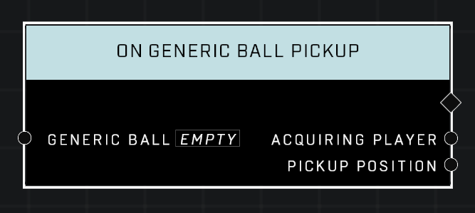

# On Generic Ball Pickup

## Description
Event called when a player explicitly picks up the given *Generic Ball*

## Node Type
Nodes fall into two basic categories: Data and Execution. This Execution node fires when something happens in the game that triggers it, and starts off the node string.

## Inputs
| Input | Type | Required | Description |
|------------------|------------------|----------|--------------------------------------------------------------|
| Generic Ball | Object | Yes | Which object to listen for when picked up. |

## Outputs
| Output | Type | Description |
|------------------|------------------|--------------------------------------------------------------|
| Acquiring Player | Object | Which player picked up the object.|
| Pickup Position | Vector3 | The location where the ball was when it was picked up.

\
\
**Contributors**

AddiCt3d 2CHa0s