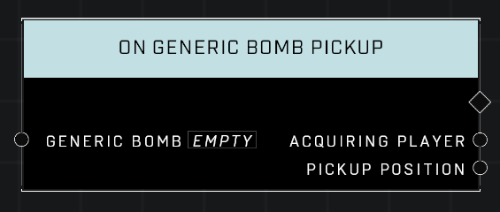

# On Generic Bomb Pickup

## Description
Event called whenever the given *Generic Bomb* is picked up

## Node Type
Nodes fall into two basic categories: Data and Execution. This Execution node fires when something happens in the game that triggers it, and starts off the node string.

## Inputs
| Input | Type | Required | Description |
|------------------|------------------|----------|--------------------------------------------------------------|
| Generic Bomb | Object | Yes | Which object to listen for when picked up. |

## Outputs
| Output | Type | Description |
|------------------|------------------|--------------------------------------------------------------|
| Acquiring Player | Player | Which player picked up the object.|
| Pickup Position | Vector3 | The location where the bomb was when it was picked up.

\
\
**Contributors**

AddiCt3d 2CHa0s \
Okom