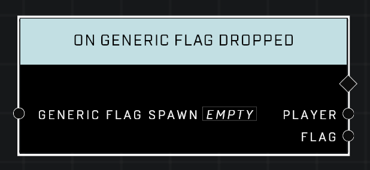

# On Generic Flag Dropped

## Description
Event called whenever a player carrying the *Generic Flag* has dropped the *Generic Flag*. Event also fires whenever a player carrying the *Generic Flag* has been killed.

## Node Type
Nodes fall into two basic categories: Data and Execution. This Execution node fires when something happens in the game that triggers it, and starts off the node string.

## Inputs
| Input | Type | Required | Description |
|------------------|------------------|----------|--------------------------------------------------------------|
| Generic Flag Spawn | Generic Flag Spawn | Yes | Which object to listen when it's flag is dropped. |

## Outputs
| Output | Type | Description |
|------------------|------------------|--------------------------------------------------------------|
| Player | Object | Which player dropped the flag.|
| Flag | Object | That flag that was being carried.|

\
\
**Contributors**

AddiCt3d 2CHa0s