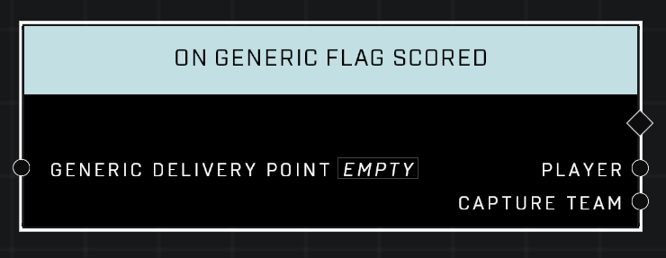

# On Generic Flag Scored

## Description
Event called whenever a *Generic Flag* is captured, returning the Player who captured the flag and their team

## Node Type
Nodes fall into two basic categories: Data and Execution. This Execution node fires when something happens in the game that triggers it, and starts off the node string.

## Inputs
| Input | Type | Required | Description |
|------------------|------------------|----------|--------------------------------------------------------------|
| Generic Delivery Point | Generic Delivery Point | Yes | Which object to listen when a flag is scored there. |

## Outputs
| Output | Type | Description |
|------------------|------------------|--------------------------------------------------------------|
| Player | Object | Which player scored the flag.|
| Capture Team | Team | Which team the flag scorer is on.|

\
\
**Contributors**

AddiCt3d 2CHa0s