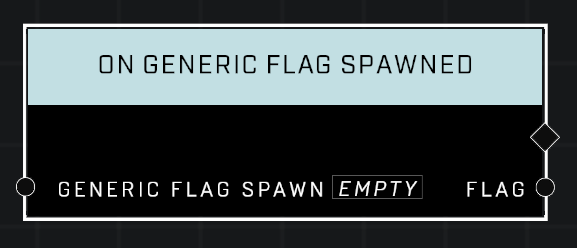

# On Generic Flag Spawned

## Description
Event called whenever the *Generic Flag* has been spawned. This occurs after the incoming state completes.

## Node Type
Nodes fall into two basic categories: Data and Execution. This Execution node fires when something happens in the game that triggers it, and starts off the node string.

## Inputs
| Input | Type | Required | Description |
|------------------|------------------|----------|--------------------------------------------------------------|
| Generic Flag Spawn | Generic Flag Spawn | Yes | Which object to listen when it's flag spawns. |

## Outputs
| Output | Type | Description |
|------------------|------------------|--------------------------------------------------------------|
| Flag | Object | That flag that spawned.|

\
\
**Contributors**

AddiCt3d 2CHa0s