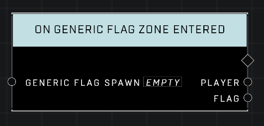

# On Generic Flag Zone Entered

## Description
Event called whenever a player enters the *Generic Flag Zone*.

## Node Type
Nodes fall into two basic categories: Data and Execution. This Execution node fires when something happens in the game that triggers it, and starts off the node string.

## Inputs
| Input | Type | Required | Description |
|------------------|------------------|----------|--------------------------------------------------------------|
| Generic Flag Spawn | Generic Flag Spawn | Yes | Which object to listen for player entering it's zone. |

## Outputs
| Output | Type | Description |
|------------------|------------------|--------------------------------------------------------------|
| Player | Object | Which player entered the zone.|
| Flag | Object | The flag whose zone was entered.|

\
\
**Contributors**

AddiCt3d 2CHa0s\
Okom