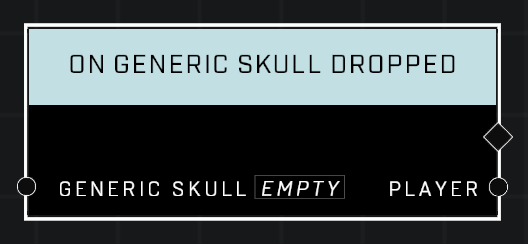

# On Generic Skull Dropped

## Description
Event called whenever the given *Generic Skull* leaves a player's hands

## Node Type
Nodes fall into two basic categories: Data and Execution. This Execution node fires when something happens in the game that triggers it, and starts off the node string.

## Inputs
| Input | Type | Required | Description |
|------------------|------------------|----------|--------------------------------------------------------------|
| Generic Skull | Object | Yes | Which object to listen for being dropped. |

## Outputs
| Output | Type | Description |
|------------------|------------------|--------------------------------------------------------------|
| Player | Object | Which player dropped the object.|

\
\
**Contributors**

AddiCt3d 2CHa0s