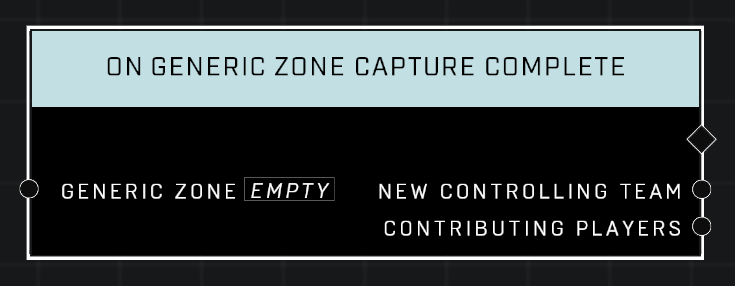

# On Generic Zone Capture Complete

## Description
Event called whenever the *Generic Zone* is cussessfully captured and a new *Controlling Team* is set.

## Node Type
Nodes fall into two basic categories: Data and Execution. This Execution node fires when something happens in the game that triggers it, and starts off the node string.

## Inputs
| Input | Type | Required | Description |
|------------------|------------------|----------|--------------------------------------------------------------|
| Generic Zone | Generic Zone | Yes | Which zone to listen to this event for. |

## Outputs
| Output | Type | Description |
|------------------|------------------|--------------------------------------------------------------|
| New Controlling Team | Team | Which team now controls the zone on capture.|
| Contributing Players | Object List | All players that helped capture the zone.|

\
\
**Contributors**

AddiCt3d 2CHa0s