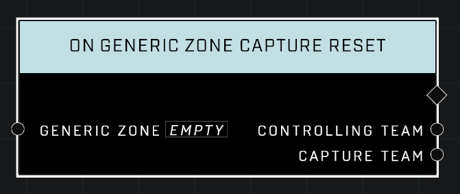

# On Generic Zone Capture Reset

## Description
Event called whenever the *Generic Zone*'s capture progress is reduced to 0 by something **other** than the *Controlling Team*. This is almost always due to Control Decay in an unoccupied zone in 2-team games. See On **Generic Capture Zone Capture Secured** for when the owning team successfully defends their own zone.

## Node Type
Nodes fall into two basic categories: Data and Execution. This Execution node fires when something happens in the game that triggers it, and starts off the node string.

## Inputs
| Input | Type | Required | Description |
|------------------|------------------|----------|--------------------------------------------------------------|
| Generic Zone | Generic Zone | Yes | Which zone to listen to this event for. |

## Outputs
| Output | Type | Description |
|------------------|------------------|--------------------------------------------------------------|
| Controlling Team | Team | Which team now controls the zone.|
| Capture Team | Team | The team that owned the zone before it reset.|

\
\
**Contributors**

AddiCt3d 2CHa0s