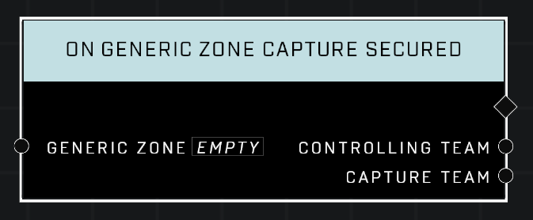

# On Generic Zone Capture Secured

## Description
Event called whenever the *Generic Zone*'s capture progress is reduced to 0 (by the)_*Controlling Team*. In other words, this event fires when the team that owns the zone successfully resets an attacker's capture progress.

## Node Type
Nodes fall into two basic categories: Data and Execution. This Execution node fires when something happens in the game that triggers it, and starts off the node string.

## Inputs
| Input | Type | Required | Description |
|------------------|------------------|----------|--------------------------------------------------------------|
| Generic Zone | Generic Zone | Yes | Which zone to listen to this event for. |

## Outputs
| Output | Type | Description |
|------------------|------------------|--------------------------------------------------------------|
| Controlling Team | Team | Team that reset their zone.|
| Capture Team | Team | The team that had captured the zone before it was reset.|

\
\
**Contributors**

AddiCt3d 2CHa0s