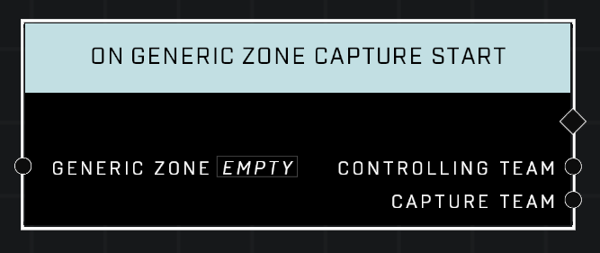

# On Generic Zone Capture Start

## Description
Event called whenever the *Generic Zone* begins to be captured by a new *Capture Team*. The *Controlling Team* is whoever currently owns the zone and may be invalid if the zone is neutral.

## Node Type
Nodes fall into two basic categories: Data and Execution. This Execution node fires when something happens in the game that triggers it, and starts off the node string.

## Inputs
| Input | Type | Required | Description |
|------------------|------------------|----------|--------------------------------------------------------------|
| Generic Zone | Generic Zone | Yes | Which zone to listen to this event for. |

## Outputs
| Output | Type | Description |
|------------------|------------------|--------------------------------------------------------------|
| Controlling Team | Team | Which team now owns the zone.|
| Capture Team | Team | The team that is now attempting to capture the zone.|

\
\
**Contributors**

AddiCt3d 2CHa0s