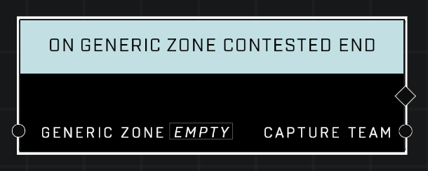

# On Generic Zone Contested End

## Description
Event called whenever the *Generic Zone* exits a Contested state and resumes capture progress. The *Capture Team* is the team currently making capture progress after the Contested state was resolved.

## Node Type
Nodes fall into two basic categories: Data and Execution. This Execution node fires when something happens in the game that triggers it, and starts off the node string.

## Inputs
| Input | Type | Required | Description |
|------------------|------------------|----------|--------------------------------------------------------------|
| Generic Zone | Generic Zone | Yes | Which zone to listen to this event for. |

## Outputs
| Output | Type | Description |
|------------------|------------------|--------------------------------------------------------------|
| Capture Team | Team | The team currently making capture progress on the zone.|

\
\
**Contributors**

AddiCt3d 2CHa0s