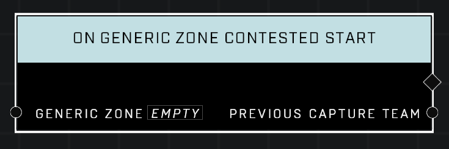

# On Generic Zone Contested Start

## Description
Event called whenever the *Generic Zone* starts to be captured and enters a Contested state. The *Previous Capture* Team is the last team that was making capture progress before the zone entered the Contested state.

## Node Type
Nodes fall into two basic categories: Data and Execution. This Execution node fires when something happens in the game that triggers it, and starts off the node string.

## Inputs
| Input | Type | Required | Description |
|------------------|------------------|----------|--------------------------------------------------------------|
| Generic Zone | Generic Zone | Yes | Which zone to listen to this event for. |

## Outputs
| Output | Type | Description |
|------------------|------------------|--------------------------------------------------------------|
| Previous Capture Team | Team | Which team was making progress on capturing before the zone was contested.|

\
\
**Contributors**

AddiCt3d 2CHa0s