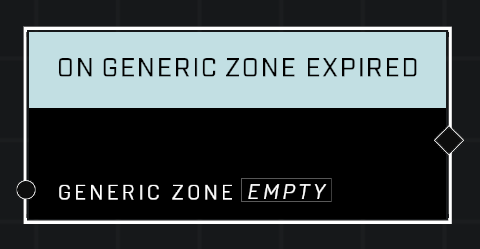

# On Generic Zone Expired

## Description
Event called whenever the *Generic Zone* expires and despawns. Does not fire if the Lifetime Timer is set to 0.

## Node Type
Nodes fall into two basic categories: Data and Execution. This Execution node fires when something happens in the game that triggers it, and starts off the node string.

## Inputs
| Input | Type | Required | Description |
|------------------|------------------|----------|--------------------------------------------------------------|
| Generic Zone | Generic Zone | Yes | Which zone to listen to this event for. |

## Outputs
| Output | Type | Description |
|------------------|------------------|--------------------------------------------------------------|
| N/A | N/A | |

\
\
**Contributors**

AddiCt3d 2CHa0s