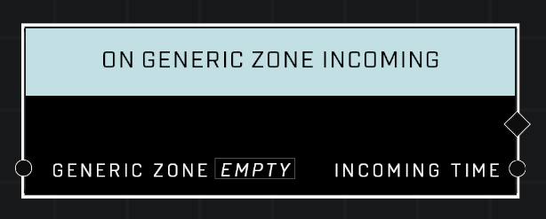

# On Generic Zone Incoming

## Description
Event called whenever the *Generic Zone* enters an Incoming state. Does not fire if the Incoming state is disabled.

## Node Type
Nodes fall into two basic categories: Data and Execution. This Execution node fires when something happens in the game that triggers it, and starts off the node string.

## Inputs
| Input | Type | Required | Description |
|------------------|------------------|----------|--------------------------------------------------------------|
| Generic Zone | Generic Zone | Yes | Which zone to listen to this event for. |

## Outputs
| Output | Type | Description |
|------------------|------------------|--------------------------------------------------------------|
| Incoming Time | Number | How many seconds before zone will spawn in.

\
\
**Contributors**

AddiCt3d 2CHa0s
