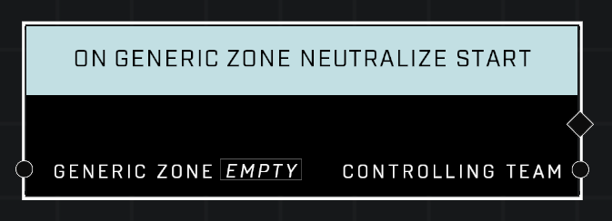

# On Generic Zone Neutralize Start

## Description
Event called whenever Control Decay begins for the *Controlling Team* that owns the *Generic Zone*. Overlaps with **On Generic Zone Score End** if the Logic Template prevents scoring.

## Node Type
Nodes fall into two basic categories: Data and Execution. This Execution node fires when something happens in the game that triggers it, and starts off the node string.

## Inputs
| Input | Type | Required | Description |
|------------------|------------------|----------|--------------------------------------------------------------|
| Generic Zone | Generic Zone | Yes | Which zone to listen to this event for. |

## Outputs
| Output | Type | Description |
|------------------|------------------|--------------------------------------------------------------|
| Controlling Team | Team | The team that owns the zone that is starting Control Decay.|

\
\
**Contributors**

AddiCt3d 2CHa0s