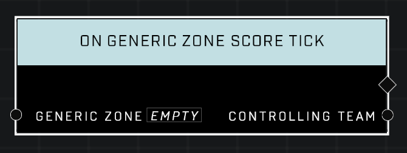

# On Generic Zone Score Tick

## Description
Event called every interval after the *Generic Zone* is fully captured and begins scoring. The interval is in seconds and is set by the zone's **Scoring Event Interval** object propery.

## Node Type
Nodes fall into two basic categories: Data and Execution. This Execution node fires when something happens in the game that triggers it, and starts off the node string.

## Inputs
| Input | Type | Required | Description |
|------------------|------------------|----------|--------------------------------------------------------------|
| Generic Zone | Generic Zone | Yes | Which zone to listen to this event for. |

## Outputs
| Output | Type | Description |
|------------------|------------------|--------------------------------------------------------------|
| Controlling Team | Team | The team that owns the zone and is currently scoring.|

\
\
**Contributors**

AddiCt3d 2CHa0s