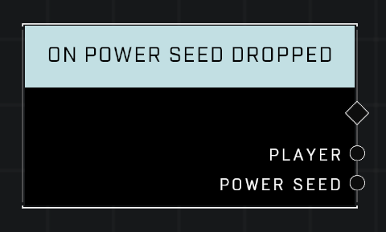

# On Power Seed Dropped

## Description
Event called whenever the given *Power Seed* leaves a player's hands

(*The above is a deprecated in-game description: this node fires for any dropped seed.*)

## Node Type
Nodes fall into two basic categories: Data and Execution. This Execution node fires when something happens in the game that triggers it, and starts off the node string.

## Inputs
| Input | Type | Required | Description |
|------------------|------------------|----------|--------------------------------------------------------------|
| N/A | N/A | N/A |  |

## Outputs
| Output | Type | Description |
|------------------|------------------|--------------------------------------------------------------|
| Player | Object | Which player dropped the object.|
| Power Seed | Object | The object that was dropped.|

\
\
**Contributors**

AddiCt3d 2CHa0s