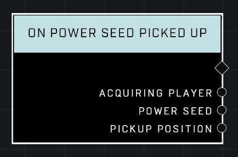

# On Power Seed Picked Up

## Description
Event called when a player explicitly picks up the given *Power Seed*

(*The above is a deprecated in-game description: this node fires for any seed that is picked up.*)

## Node Type
Nodes fall into two basic categories: Data and Execution. This Execution node fires when something happens in the game that triggers it, and starts off the node string.

## Inputs
| Input | Type | Required | Description |
|------------------|------------------|----------|--------------------------------------------------------------|
| N/A | N/A | N/A |  |

## Outputs
| Output | Type | Description |
|------------------|------------------|--------------------------------------------------------------|
| Acquiring Player | Object | Which player picked up the object.|
| Power Seed | Object | The object that was picked up.|
| Pickup Position | Vector3 | The location of the seed before it was picked up.|

\
\
**Contributors**

AddiCt3d 2CHa0s