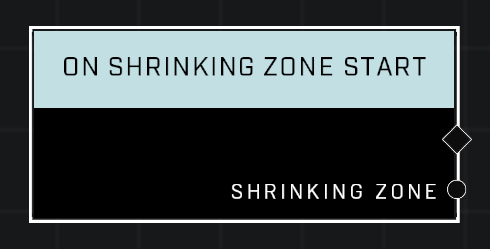

# On Shrinking Zone Start

## Description
Event called when the *Shrinking Zone* starts its shrinking sequence. This is triggered every time the zone starts to shrink.

## Node Type
Nodes fall into two basic categories: Data and Execution. This Execution node fires when something happens in the game that triggers it, and starts off the node string.

## Inputs
| Input | Type | Required | Description |
|------------------|------------------|----------|--------------------------------------------------------------|
| N/A | N/A | N/A |  |

## Outputs
| Output | Type | Description |
|------------------|------------------|--------------------------------------------------------------|
| Shrinking Zone | Object | Which zone has started shrinking.|

\
\
**Contributors**

AddiCt3d 2CHa0s