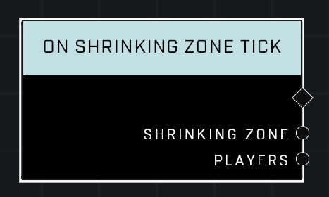

# On Shrinking Zone Tick

## Description
Event called whenever players take damage from the *Shrinking Zone*

## Node Type
Nodes fall into two basic categories: Data and Execution. This Execution node fires when something happens in the game that triggers it, and starts off the node string.

## Inputs
| Input | Type | Required | Description |
|------------------|------------------|----------|--------------------------------------------------------------|
| N/A | N/A | N/A |  |

## Outputs
| Output | Type | Description |
|------------------|------------------|--------------------------------------------------------------|
| Shrinking Zone | Object | Which zone is currently damaging a player.|
| Players | Object List | List of players who are currently being damaged.|

\
\
**Contributors**

AddiCt3d 2CHa0s