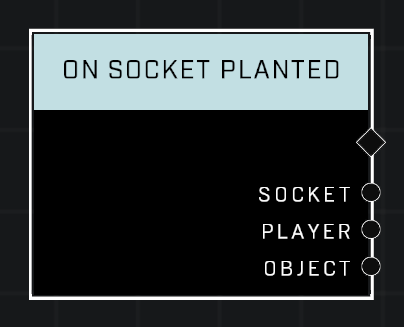

# On Socket Planted

## Description
Event called when an *Object* is planted into a socket

## Node Type
Nodes fall into two basic categories: Data and Execution. This Execution node fires when something happens in the game that triggers it, and starts off the node string.

## Inputs
| Input | Type | Required | Description |
|------------------|------------------|----------|--------------------------------------------------------------|
| N/A | N/A | N/A |  |

## Outputs
| Output | Type | Description |
|------------------|------------------|--------------------------------------------------------------|
| Socket | Object | Which socket an object was planted at.|
| Player | Object | Player who planted an object at the socket.|
| Object | Object | Object that was planted at the socket.|

\
\
**Contributors**

AddiCt3d 2CHa0s