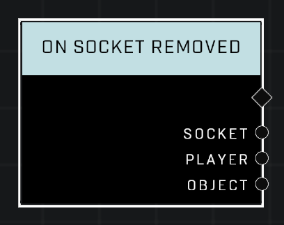

# On Socket Removed

## Description
Event called when an *Object* is removed from a socket

## Node Type
Nodes fall into two basic categories: Data and Execution. This Execution node fires when something happens in the game that triggers it, and starts off the node string.

## Inputs
| Input | Type | Required | Description |
|------------------|------------------|----------|--------------------------------------------------------------|
| N/A | N/A | N/A |  |

## Outputs
| Output | Type | Description |
|------------------|------------------|--------------------------------------------------------------|
| Socket | Object | Which socket an object was removed from.|
| Player | Object | Player who removed an object from the socket.|
| Object | Object | Object that was removed from the socket.|

\
\
**Contributors**

AddiCt3d 2CHa0s
