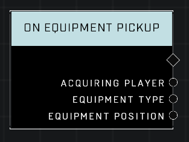

# On Equipment Pickup

## Description
Event called when a player picks up equipment. Unlike the **On Weapon Pickup** event, ammo refills DO trigger this event.

## Node Type
Nodes fall into two basic categories: Data and Execution. This node listens for an Event, then triggers it's node string.

## Inputs
| Input | Type | Required | Description |
|------------------|------------------|----------|--------------------------------------------------------------|
| N/A | N/A | N/A | |

## Outputs
| Output | Type | Description |
|------------------|------------------|--------------------------------------------------------------|
| Acquiring Player | Object | Which player picked up the equipment.|
| Equipment Type | Equipment Type | Which equipment player picked up.|
| Equipment Position | Vector3 | Location Equipment was at when it was picked up.|

\
\
**Contributors**

AddiCt3d 2CHa0s