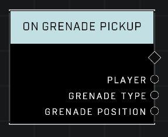

# On Grenade Pickup

## Description
Event called when a player explicitly picks up a grenade

## Node Type
Nodes fall into two basic categories: Data and Execution. This node listens for an Event, then triggers it's node string.

## Inputs
| Input | Type | Required | Description |
|------------------|------------------|----------|--------------------------------------------------------------|
| N/A | N/A | N/A | |

## Outputs
| Output | Type | Description |
|------------------|------------------|--------------------------------------------------------------|
| Player | Object | Which player dropped the object.|
| Grenade Type | Grenade Type | Which grenade type player picked up.|
| Grenade Position | Vector3 | Location grenade was at when picked up.|

\
\
**Contributors**

AddiCt3d 2CHa0s