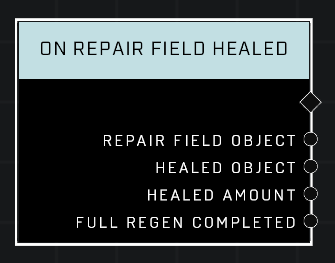

# On Repair Field Healed

## Description
Event called when an object is healed by a Repair Field

## Node Type
Nodes fall into two basic categories: Data and Execution. This node listens for an Event, then triggers it's node string.

## Inputs
| Input | Type | Required | Description |
|------------------|------------------|----------|--------------------------------------------------------------|
| N/A | N/A | N/A | |

## Outputs
| Output | Type | Description |
|------------------|------------------|--------------------------------------------------------------|
| Repair Field Object | Object | Object that is repairing.|
| Healed Object | Object | Object that is being repaired.|
| Healed Amount | Number | How much is healed.|
| Full Regen Completed | Boolean | True if the object being healed was healed completely.|

\
\
**Contributors**

AddiCt3d 2CHa0s