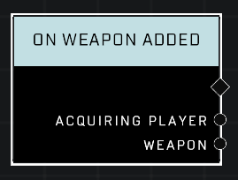

# On Weapon Added

## Description
Event called when a weapon is added to a player's inventory. Ammo refills for a weapon a player is already holding will NOT trigger this event.

## Node Type
Nodes fall into two basic categories: Data and Execution. This node listens for an Event, then triggers it's node string..

## Inputs
| Input | Type | Required | Description |
|------------------|------------------|----------|--------------------------------------------------------------|
| N/A | N/A | N/A | |

## Outputs
| Output | Type | Description |
|------------------|------------------|--------------------------------------------------------------|
| Acquiring Player | Object | Which player gained a weapon.|
| Weapon | Object | Which weapon player gained.|

\
\
**Contributors**

AddiCt3d 2CHa0s