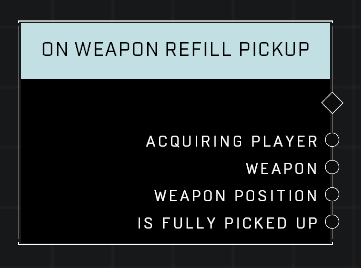

# On Weapon Refill Pickup

## Description
Event called when a weapon is picked up for an ammo refill. *Is Fully Picked Up* will return true if the weapon was despawned.

## Node Type
Nodes fall into two basic categories: Data and Execution. This node listens for an Event, then triggers it's node string.

## Inputs
| Input | Type | Required | Description |
|------------------|------------------|----------|--------------------------------------------------------------|
| N/A | N/A | N/A | |

## Outputs
| Output | Type | Description |
|------------------|------------------|--------------------------------------------------------------|
| Acquiring Player | Object | Which player picked up a refill.|
| Weapon | Object | Which weapon is supplying the player with ammo.|
| Weapon Position | Vector3 | Location weapon was at when it's ammo was picked up.|
| Is Fully Picked Up | Boolean | Whether or not the weapon supplying the ammo is now empty.|

\
\
**Contributors**

AddiCt3d 2CHa0s