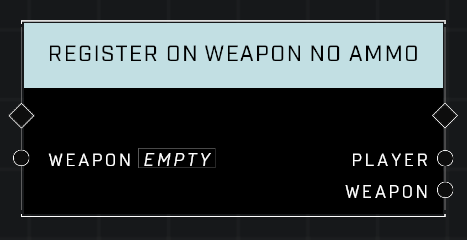

# Register On Weapon No Ammo


This node was originally created to cover instances where weapons created using **Spawn Mode Object** might not trigger the **On Weapon No Ammo** Event, but they do, so it's currently not needed.


## Description
(Registers a weapon so an) Event executes when the given _Weapon_ runs out of ammo.  

## Node Type
Nodes fall into two basic categories: Data and Execution. This node Executes a function directly in the node string.

## Inputs
| Input | Type | Required | Description |
|------------------|------------------|----------|--------------------------------------------------------------|
| Weapon| Weapon | Yes | Weapon to register for On Weapon No Ammo event. |

## Outputs
| Output | Type | Description |
|------------------|------------------|--------------------------------------------------------------|
| Player | Object | Deprecated. |
| Weapon | Object | Deprecated. |

\
\
**Contributors**

AddiCt3d 2CHa0s \
Okom \
Jordan9232