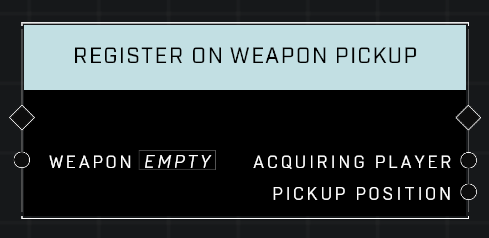

# Register On Weapon Pickup

## Description
(Registers a weapon so an) Event executes when a player explicitly picks up the given _Weapon_.  

## Node Type
Nodes fall into two basic categories: Data and Execution. This node Executes a function directly in the node string.

## Inputs
| Input | Type | Required | Description |
|------------------|------------------|----------|--------------------------------------------------------------|
| Weapon | Weapon | Yes | Which weapon to listen for it being picked up. |

## Outputs
| Output | Type | Description |
|------------------|------------------|--------------------------------------------------------------|
| Acquiring Player | Player | Which player picked up the weapon.|
| Pickup Position | Vector3 | Location weapon was at when it was picked up.|

## Notes
This node was originally created to cover instances where weapons created using **Spawn Mode Object** might not trigger the **On Weapon Pickup** Event, but they do, so it's currently not needed.

\
\
**Contributors**

AddiCt3d 2CHa0s \
Okom \
Jordan9232