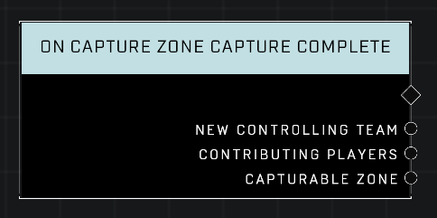

# On Capture Zone Capture Complete

## Description
Event called whenever any *Capturable Zone* is successfully captured and a new *Controlling Team* is set.

## Node Type
Nodes fall into two basic categories: Data and Execution. This node listens for an Event, then triggers it's node string.

## Inputs
| Input | Type | Required | Description |
|------------------|------------------|----------|--------------------------------------------------------------|
| N/A | N/A | N/A | |

## Outputs
| Output | Type | Description |
|------------------|------------------|--------------------------------------------------------------|
| New Controlling Team | Team | Team that has just captured the zone.|
| Contributing Players | Object List | All players who helped capture the zone.|
| Capturable Zone | Object | The zone that was just captured.|

\
\
**Contributors**

AddiCt3d 2CHa0s