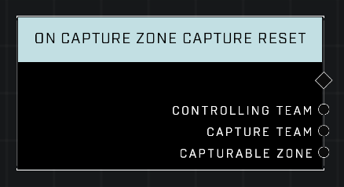

# On Capture Zone Capture Reset

## Description
Event called whenever any *Capturable Zone*'s capture progress is reduced to 0 by something other than the *Controlling Team*. This is almost always due to Control Decay in an unoccupied zone in 2-team games. See On **Generic Capture Zone Capture Secured** for when the owning team successfully defends their own zone.

## Node Type
Nodes fall into two basic categories: Data and Execution. This node listens for an Event, then triggers it's node string.

## Inputs
| Input | Type | Required | Description |
|------------------|------------------|----------|--------------------------------------------------------------|
| N/A | N/A | N/A | |

## Outputs
| Output | Type | Description |
|------------------|------------------|--------------------------------------------------------------|
| Controlling Team | Team | Team that owns the zone.|
| Capture Team | Team | The team whose capture attempt progress was reset.|
| Capturable Zone | Object | The zone that was just reset.|

\
\
**Contributors**

AddiCt3d 2CHa0s