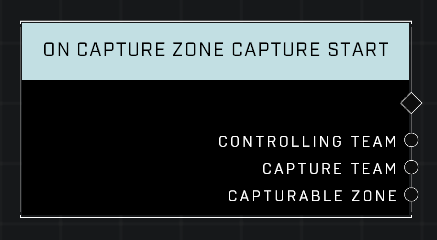

# On Capture Zone Capture Start

## Description
Event called whenever any Capturable Zone begins to be captured by a new *Capture Team*. The *Controlling Team* is whoever currently owns the zone and may be invalid if the zone is neutral.

## Node Type
Nodes fall into two basic categories: Data and Execution. This node listens for an Event, then triggers it's node string.

## Inputs
| Input | Type | Required | Description |
|------------------|------------------|----------|--------------------------------------------------------------|
| N/A | N/A | N/A | |

## Outputs
| Output | Type | Description |
|------------------|------------------|--------------------------------------------------------------|
| Controlling Team | Team | Team that owns the zone.|
| Capture Team | Team | The team attempting to capture the zone.|
| Capturable Zone | Object | The zone that is being captured.|

\
\
**Contributors**

AddiCt3d 2CHa0s