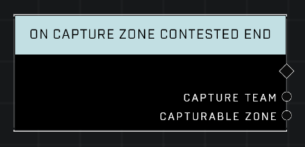

# On Capture Zone Contested End

## Description
Event called whenever any *Capturable Zone* exits a Contested state and resumes capture progress. The *Capture Team* is the team currently making capture progress after the Contested state was resolved.

## Node Type
Nodes fall into two basic categories: Data and Execution. This node listens for an Event, then triggers it's node string.

## Inputs
| Input | Type | Required | Description |
|------------------|------------------|----------|--------------------------------------------------------------|
| N/A | N/A | N/A | |

## Outputs
| Output | Type | Description |
|------------------|------------------|--------------------------------------------------------------|
| Capture Team | Team | The team with capture progress on the zone.|
| Capturable Zone | Object | The zone that is being captured.|

\
\
**Contributors**

AddiCt3d 2CHa0s