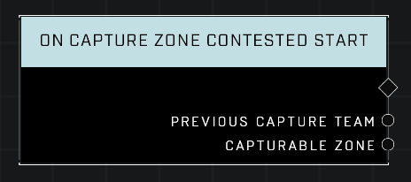

# On Capture Zone Contested Start

## Description
Event called whenever any *Capturable Zone* starts to be captured and enters a Contested state. The *Previous Capture Team* is the last team that was making capture progress before the zone entered the Contested state.

## Node Type
Nodes fall into two basic categories: Data and Execution. This node listens for an Event, then triggers it's node string.

## Inputs
| Input | Type | Required | Description |
|------------------|------------------|----------|--------------------------------------------------------------|
| N/A | N/A | N/A | |

## Outputs
| Output | Type | Description |
|------------------|------------------|--------------------------------------------------------------|
| Previous Capture Team | Team | The team making progress on capturing before another team contested the zone.|
| Capturable Zone | Object | The zone that is being contested.|

\
\
**Contributors**

AddiCt3d 2CHa0s