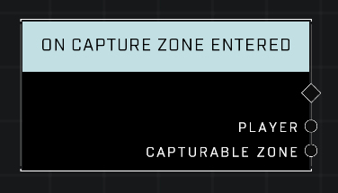

# On Capture Zone Entered

## Description
Event called whenever a player enters any *Capturable Zone*'s boundary. Behaves like an Area Monitor, but only tracks players and players in vehicles.

## Node Type
Nodes fall into two basic categories: Data and Execution. This node listens for an Event, then triggers it's node string.

## Inputs
| Input | Type | Required | Description |
|------------------|------------------|----------|--------------------------------------------------------------|
| N/A | N/A | N/A | |

## Outputs
| Output | Type | Description |
|------------------|------------------|--------------------------------------------------------------|
| Player | Object | Player who has entered the zone.|
| Capturable Zone | Object | The zone a player has just entered.|

\
\
**Contributors**

AddiCt3d 2CHa0s