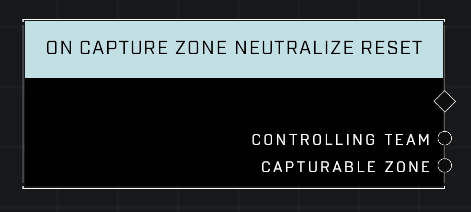

# On Capture Zone Neutralize Reset

## Description
Event called when the *Controlling Team* that owns any *Capturable Zone* resets their Control Decay to 0, effectivvely securing the zone.

## Node Type
Nodes fall into two basic categories: Data and Execution. This node listens for an Event, then triggers it's node string.

## Inputs
| Input | Type | Required | Description |
|------------------|------------------|----------|--------------------------------------------------------------|
| N/A | N/A | N/A | |

## Outputs
| Output | Type | Description |
|------------------|------------------|--------------------------------------------------------------|
| Controlling Team | Team | The team that has neutralized their zone.|
| Capturable Zone | Object | The zone that was just neutralized.|

\
\
**Contributors**

AddiCt3d 2CHa0s