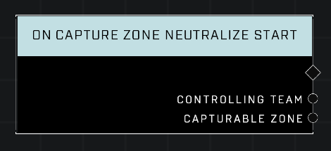

# On Capture Zone Neutralize Start

## Description
Event called whenever Control Decay begins for the *Controlling Team* that owns any Zone. Overlaps with **On Zone Score End** if the Logic Template prevents scoring.

## Node Type
Nodes fall into two basic categories: Data and Execution. This node listens for an Event, then triggers it's node string.

## Inputs
| Input | Type | Required | Description |
|------------------|------------------|----------|--------------------------------------------------------------|
| N/A | N/A | N/A | |

## Outputs
| Output | Type | Description |
|------------------|------------------|--------------------------------------------------------------|
| Controlling Team | Team | The team that currently owns the zone.|
| Capturable Zone | Object | The zone that is being neutralized.|

\
\
**Contributors**

AddiCt3d 2CHa0s