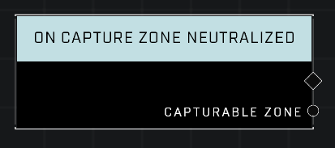

# On Capture Zone Neutralized

## Description
Event called when the *Controlling Team* for any *Capturable Zone* is reverted to nil, making the zone unowned.

## Node Type
Nodes fall into two basic categories: Data and Execution. This node listens for an Event, then triggers it's node string.

## Inputs
| Input | Type | Required | Description |
|------------------|------------------|----------|--------------------------------------------------------------|
| N/A | N/A | N/A | |

## Outputs
| Output | Type | Description |
|------------------|------------------|--------------------------------------------------------------|
| Capturable Zone | Object | The zone that just changed to a neutralized state.|

\
\
**Contributors**

AddiCt3d 2CHa0s