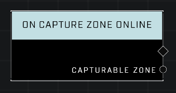

# On Capture Zone Online

## Description
Event called whenever any *Capturable Zone* completes the Incoming state (if enabled) and becomes capturable.

## Node Type
Nodes fall into two basic categories: Data and Execution. This node listens for an Event, then triggers it's node string.

## Inputs
| Input | Type | Required | Description |
|------------------|------------------|----------|--------------------------------------------------------------|
| N/A | N/A | N/A | |

## Outputs
| Output | Type | Description |
|------------------|------------------|--------------------------------------------------------------|
| Capturable Zone | Object | The zone that has just come online.|

\
\
**Contributors**

AddiCt3d 2CHa0s