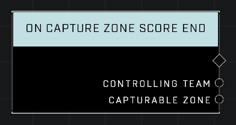

# On Capture Zone Score End

## Description
Event called whenever the *Controlling Team* loses scoring control of any *Capturable Zone* and the zone stops emitting **On Zone Score Tick** events.

## Node Type
Nodes fall into two basic categories: Data and Execution. This node listens for an Event, then triggers it's node string.

## Inputs
| Input | Type | Required | Description |
|------------------|------------------|----------|--------------------------------------------------------------|
| N/A | N/A | N/A | |

## Outputs
| Output | Type | Description |
|------------------|------------------|--------------------------------------------------------------|
| Controlling Team | Team | Team that owned the zone when it stopped scoring.|
| Capturable Zone | Object | The zone that stopped scoring.|

\
\
**Contributors**

AddiCt3d 2CHa0s