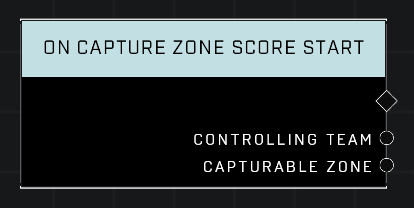

# On Capture Zone Score Start

## Description
Event called whenever the *Controlling Team* gains scoring control (i.e. uncontested, no delay, etc.) of any *Capturable Zone* and the zone begins emitting **On Generic Zone Score Tick** events.

## Node Type
Nodes fall into two basic categories: Data and Execution. This node listens for an Event, then triggers it's node string.

## Inputs
| Input | Type | Required | Description |
|------------------|------------------|----------|--------------------------------------------------------------|
| N/A | N/A | N/A | |

## Outputs
| Output | Type | Description |
|------------------|------------------|--------------------------------------------------------------|
| Controlling Team | Team | The team that has just starting scoring in the zone.|
| Capturable Zone | Object | The zone that has just started scoring.|

\
\
**Contributors**

AddiCt3d 2CHa0s