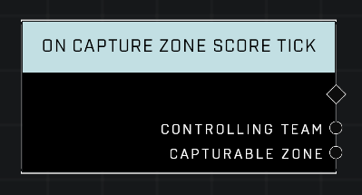

# On Capture Zone Score Tick

## Description
Event called every interval after any *Capturable Zone* is fully captured and begins scoring. The interval is in seconds and is set by the zone's Scoring Event Interval object property.

## Node Type
Nodes fall into two basic categories: Data and Execution. This node listens for an Event, then triggers it's node string.

## Inputs
| Input | Type | Required | Description |
|------------------|------------------|----------|--------------------------------------------------------------|
| N/A | N/A | N/A | |

## Outputs
| Output | Type | Description |
|------------------|------------------|--------------------------------------------------------------|
| Controlling Team | Team | The team that currently owns the zone.|
| Capturable Zone | Object | The zone that is scoring.|

\
\
**Contributors**

AddiCt3d 2CHa0s