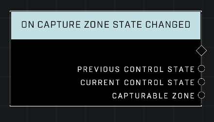

# On Capture Zone State Changed

## Description
Event called whenever any *Capturable Zone* enters a new Control State

## Node Type
Nodes fall into two basic categories: Data and Execution. This node listens for an Event, then triggers it's node string.

## Inputs
| Input | Type | Required | Description |
|------------------|------------------|----------|--------------------------------------------------------------|
| N/A | N/A | N/A | |

## Outputs
| Output | Type | Description |
|------------------|------------------|--------------------------------------------------------------|
| Previous Control State | Control State | Which state the zone was in before it changed states (ie: Controlled, Contested, Neutralized). |
| Current Control State | Control State | Which state the zone is in currently. |
| Capturable Zone | Object | The zone that has just changed states.|

\
\
**Contributors**

AddiCt3d 2CHa0s