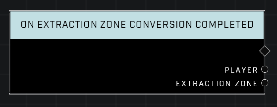

# On Extraction Zone Conversion Completed

## Description
Event called whenever any *Extraction Zone* conversion is completed successfully.

## Node Type
Nodes fall into two basic categories: Data and Execution. This node listens for an Event, then triggers it's node string.

## Inputs
| Input | Type | Required | Description |
|------------------|------------------|----------|--------------------------------------------------------------|
| N/A | N/A | N/A | |

## Outputs
| Output | Type | Description |
|------------------|------------------|--------------------------------------------------------------|
| Player | Object | Which player armed the Extraction Zone that was just converted.|
| Extraction Zone | Object | The zone that was just converted.|

\
\
**Contributors**

AddiCt3d 2CHa0s