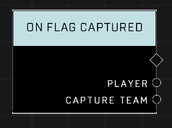

# On Flag Captured

## Description
Event called whenever a Flag is captured, returning the Player who captured the flag and their team. This node only works in CTF game modes.

## Node Type
Nodes fall into two basic categories: Data and Execution. This node listens for an Event, then triggers it's node string.

## Inputs
| Input | Type | Required | Description |
|------------------|------------------|----------|--------------------------------------------------------------|
| N/A | N/A | N/A | |

## Outputs
| Output | Type | Description |
|------------------|------------------|--------------------------------------------------------------|
| Player | Object | Which player captured the flag.|
| Capture Team | Equipment Type | What team the flag scorer is on.|

\
\
**Contributors**

AddiCt3d 2CHa0s