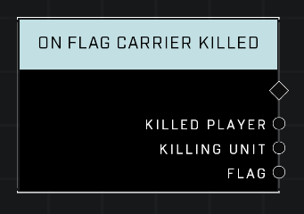

# On Flag Carrier Killed

## Description
Event called whenever a player carrying the Flag has been killed

## Node Type
Nodes fall into two basic categories: Data and Execution. This node listens for an Event, then triggers it's node string.

## Inputs
| Input | Type | Required | Description |
|------------------|------------------|----------|--------------------------------------------------------------|
| N/A | N/A | N/A | |

## Outputs
| Output | Type | Description |
|------------------|------------------|--------------------------------------------------------------|
| Killed Player | Object | Which player carrying the flag was killed.|
| Killing Unit | Object | Which unit killed the flag carrier.|
| Flag | Object | Flag player was holding when they were killed.|

\
\
**Contributors**

AddiCt3d 2CHa0s