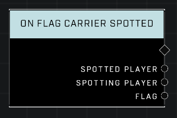

# On Flag Carrier Spotted

## Description
Event called whenever a player carrying the Flag has been spotted. This event only fires in modes that allow hiding and spotting of the Flag Carrier.

## Node Type
Nodes fall into two basic categories: Data and Execution. This node listens for an Event, then triggers it's node string.

## Inputs
| Input | Type | Required | Description |
|------------------|------------------|----------|--------------------------------------------------------------|
| N/A | N/A | N/A | |

## Outputs
| Output | Type | Description |
|------------------|------------------|--------------------------------------------------------------|
| Spotted Player | Object | Which player carrying the flag was spotted.|
| Spotting Player | Object | Which player spotted the flag carrier.|
| Flag | Object | Flag player is holding when they were spotted.|

\
\
**Contributors**

AddiCt3d 2CHa0s