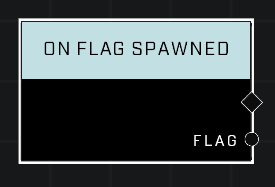

# On Flag Spawned

## Description
Event called whenever the Flag has been spawned. This occurs after the incoming state completes.

## Node Type
Nodes fall into two basic categories: Data and Execution. This node listens for an Event, then triggers it's node string.

## Inputs
| Input | Type | Required | Description |
|------------------|------------------|----------|--------------------------------------------------------------|
| N/A | N/A | N/A | |

## Outputs
| Output | Type | Description |
|------------------|------------------|--------------------------------------------------------------|
| Flag | Object | Flag that has just spawned.|
\
\
**Contributors**

AddiCt3d 2CHa0s